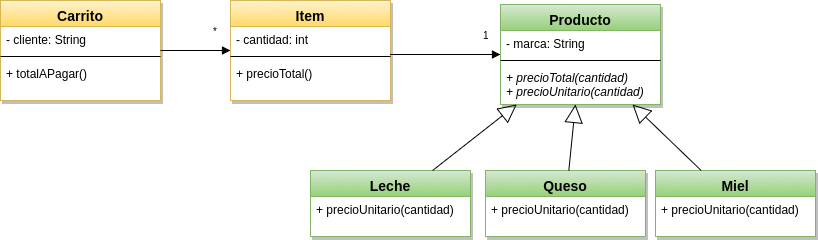
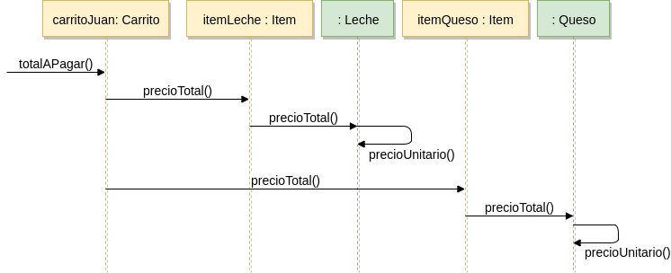

# Introducción (breve) a ES6

## El ejemplo del Carrito

Queremos programar un almacén, que vende 3 tipos de productos: Leche, Queso y Miel. Todos los productos tienen una marca y un peso que determina su precio unitario. Nuestro programa tiene que poder decir el precio de un producto, armar un carrito de compras que tenga productos (y sus cantidades) y saber el total a pagar.

Los cálculos de precios son los siguientes:

> **Leche** = si compra por cantidad (más de 10 unidades) el precio unitario es 5, de lo contrario sale 10

> **Queso** = todos valen 50 pesos por unidad

> **Miel** = la miel "Real" sale 20 pesos por unidad, las otras salen 15

## Modelando el carrito "orientado a objetos"

### Modelar los productos

La leche, el queso y la miel, se representan con clases porque tienen comportamiento diferente.
Para reutilizar el valor del precio total (cantidad * precio unitario), en lugar de una función común hacemos que hereden Leche, Queso y Miel de una clase más general Producto, donde la definición del cálculo queda representada en un solo lugar.

### Modelar el carrito

El carrito se representa como instancia de una clase Carrito, que tiene un cliente y una lista de ítems, que abstraen

- cantidad
- y producto.

## Diagrama de clases de la solución

### Calcular el total de un carrito

Para calcular el total de un carrito, delegamos en cada ítem que a su vez deja que cada producto lo resuelva.

## Tests

Los tests están en la carpeta spec y prueban unitariamente el queso, la leche y el valor total de un carrito.

